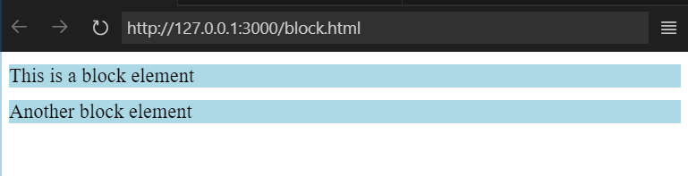
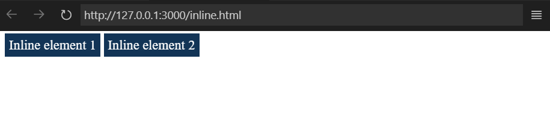
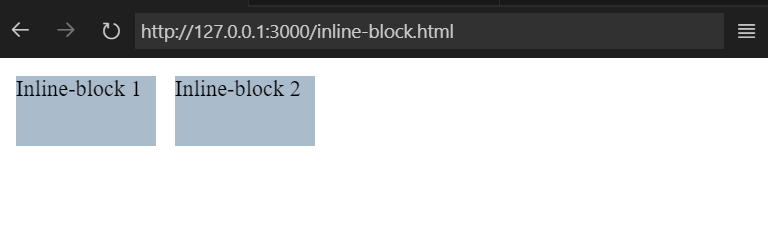

# Display trong CSS

Thuộc tính `display` trong CSS là một trong những thuộc tính **quan trọng nhất**, quyết định cách một phần tử HTML được hiển thị trong trình duyệt như thế nào. Sau đây là một số giá trị **phổ biến** của thuộc tính `display`:

## 1. Block

- Phần tử sẽ hiển thị dưới dạng một khối 
- Chiếm toàn bộ chiều rộng của phần tử chứa nó
- Các phần tử `block` khác sẽ được *hiển thị ở dòng mới*
- Ví dụ: `div`, `h1 - h6`, `p`... Là các phần tử có `display: block;` theo mặc định.

**block.html:**
```
<!DOCTYPE html>
<html lang="en">
<head>
    <meta charset="UTF-8">
    <meta name="viewport" content="width=device-width, initial-scale=1.0">
    <title>Display | Block</title>

    <style>
        .block-example {
            background-color: lightblue;
            margin: 10px 0;
            display: block;
        }
    </style>
</head>
<body>
    <div class="block-example">This is a block element</div>
    <div class="block-example">Another block element</div>
</body>
</html>
```
Mở file `block.html` bạn sẽ thấy kết quả như sau:



Như đã nói ở trên `block` sẽ chiếm toàn bộ chiều rộng của phần tử cha và các `block` sẽ được hiển thị ở những dòng mới.

## 2. Inline

- Phần tử sẽ hiển thị dưới dạng một phần tử nội tuyến (inline element)
- Chỉ chiếm không gian vừa đủ nội dung của nó
- Các phần tử `inline` sẽ hiển thị trên *cùng một dòng* nếu nó có đủ không gian
- Ví dụ: `<span>`, `<a>`, `<strong>`... là các phần tử có `display: inline;` theo mặc định.

**inline.html:**
```

<!DOCTYPE html>
<html lang="en">
<head>
    <meta charset="UTF-8">
    <meta name="viewport" content="width=device-width, initial-scale=1.0">
    <title>Display | Inline</title>

    <style>
        .inline-example {
            display: inline;
            color: #fff;
            background-color: #123456;
            margin: 0;
            padding: 5px;
        }
    </style>
</head>
<body>
    <!-- Có khoảng cách giữa 2 span là do xuống dòng giữa 2 span -->
    <span class="inline-example">Inline element 1</span>
    <span class="inline-example">Inline element 2</span>
</body>
</html>
```
Mở file `inline.html` bạn sẽ thấy kết quả như sau:



Các phần tử `<span>` với `display: inline;` sẽ hiển thị trên cùng một dòng, chỉ chiếm không gian theo nội dung của chúng.

## 3. Inline-block

- Kết hợp đặc điểm của `block`và `inline`
- Phần tử vẫn xếp trên cùng một dòng với các phần tử `inline` khác, nhưng có thể thiết lập chiều rộng và chiều cao giống như các phần tử `block`
- Thường dùng khi bạn muốn các phần tử có kích thước cụ thể nhưng vẫn hiển thị trên cùng một dòng.

**inline-block.html:**
```
<!DOCTYPE html>
<html lang="en">
<head>
    <meta charset="UTF-8">
    <meta name="viewport" content="width=device-width, initial-scale=1.0">
    <title>Display | Inline-block</title>

    <style>
        .inline-block-example {
            display: inline-block;
            width: 100px;
            height: 50px;
            background: #abc;
            margin: 5px;
        }
    </style>
</head>
<body>
    <div class="inline-block-example">Inline-block 1</div>
    <div class="inline-block-example">Inline-block 2</div>
</body>
</html>
```
Mở file `inline-block.html` bạn sẽ thấy kết quả như sau:



## 4. None

- Phần tử sẽ không được hiển thị trên trang và **không chiếm không gian nào**.

**none.html:**
```
<!DOCTYPE html>
<html lang="en">
<head>
    <meta charset="UTF-8">
    <meta name="viewport" content="width=device-width, initial-scale=1.0">
    <title>Display | None</title>

    <style>
        .none-example {
            background: #bcd;
            display: none;
        }
    </style>
</head>
<body>
    <div class="none-example">None ex</div>
</body>
</html>
```
Mở file `none.html` bạn sẽ thấy kết quả như sau:

